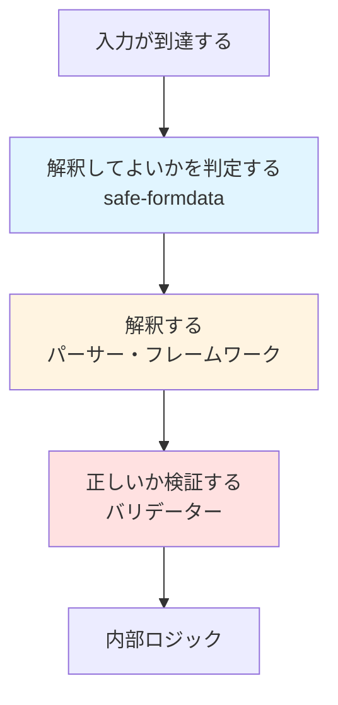

## 導入：前提への疑問

FormDataを特別なものとして、普段から意識することはあまりありません。
多くのアプリケーションでは、FormDataは「意味のある入力」として自然に扱われています。

しかし、その意味はどこで保証されているのでしょうか。
本当にアプリケーション内部で解釈してよい入力なのかを、FormDataの段階で明示的に確認しているコードは多くありません。

問題は、特定の実装が危険だということではありません。
問題は、「解釈してよい入力である」という前提が暗黙になっていることにあります。

## FormDataは「意味」を持たない

FormDataは、HTTPリクエストから得られるキーと値の集合にすぎません。

- ネスト構造はない
- 配列という概念もない
- オブジェクトでもない

それにもかかわらず、多くのアプリケーションではFormDataが構造を持つものとして扱われています。
これはFormDataに構造があるのではなく、構造が「読み取られている」だけです。

この「読み取り」は便利です。しかし同時に、「読み取り結果が安全である」という新しい前提をアプリケーションに持ち込みます。

## 実際に起きた事故（CVE 実例）

この前提が問題になるのは、理論上の話だけではありません。

### tRPCの事例

tRPCではFormDataのキー名を解釈して構造を作る過程で、意図しない解釈の余地が生まれました。[^1]

問題だったのは特殊な攻撃手法ではなく、「安全な形になっているはずだ」という前提がコードのどこにも明示されていなかったことでした。

### superformsの事例

superformsでもフォーム処理を抽象化する過程で、入力の前提条件がフレームワーク内部に隠れました。[^2]

利用者のコードからは、どこで安全性が担保されているのかを判断しにくい構造になっていました。

---

:::details form-dataで起きた別系統の事例
ここで挙げる事例は、FormDataの解釈が原因で起きた事故ではありません。
入力境界が曖昧なまま機能拡張された結果、問題が顕在化した例です。

境界が曖昧なまま入力を扱ったことで、想定外の解釈が可能になる余地が生まれました。[^3]
この事例は特定の実装ミスというよりも、「どこで安全性を判断するのか」が設計上不明確だったことに起因しています。
:::

## 何が共通していたのか

前章で紹介した事例は、個別の欠陥ではありません。境界を明示しない設計が積み重なった結果と見る方が自然です。

これらの事例に共通していたのは、FormDataのキー名から構造を読み取る仕組みでした。
フラットなキーと値のペアから、ネストしたオブジェクトや配列を復元する際に、問題が生まれていました。

設計の視点で見ると、欠けていたのは驚くほど単純な3点です。

- 解釈のルールが暗黙に存在していた
- どのような入力が許容されるかの境界が明確でなかった
- 「この入力を解釈してよいか」を問う段階が存在しなかった

多くのコードでは**どう解釈するか**は考えられていても、**解釈してよいか**は問われていませんでした。

「解釈する前」という段階そのものが、設計に存在していなかったのです。

## 境界でやるべきこと

アプリケーションの境界で行うべきなのは、入力を理解することではありません。

- 意味を推測しない
- 曖昧さを解消しない
- 便利な形に直さない

境界の役割は、ただ一つしかありません。
それは「**この入力を、内部で解釈してよいかを判定すること**」です。

境界で意味を与えると、その意味が境界の内側で固定されます。
固定化された意味は正しいという前提のもと、内部ロジックは動作することになります。

## 境界が守るもの

境界が明示されていないコードでは、どのような危険があるのでしょうか。

最も代表的なのは**プロトタイプ汚染**です。
JavaScriptでは`__proto__`や`constructor`といったキーが、オブジェクトの振る舞いそのものを変更できます。

```ts
// FormDataに __proto__ というキーが含まれていたら？
const data = {};
data["__proto__"] = { isAdmin: true }; // 危険

// すべてのオブジェクトが影響を受ける可能性
```

境界を持たないパーサーは、このような入力を「ただのキー名」として処理してしまいます。
safe-formdataはこれらのキーを明示的に禁止します。

## safe-formdataは何をするライブラリか

safe-formdataはFormDataを「使いやすくする」のではなく、**解釈する前に立ち止まって判定するため**に設計されています。

FormDataに対して、このライブラリは以下の変換をしません。

- オブジェクトにしない
- 配列にしない
- 型を付けない
- 意味を与えない

代わりに、次の一点だけを行います。

> アプリケーション内部で、このFormDataを解釈しても安全か

### リンク

@[card](https://github.com/roottool/safe-formdata)
@[card](https://www.npmjs.com/package/safe-formdata)

### 基本的な使い方

safe-formdataはFormDataを変換せず、判定結果を返します。

```ts
import { parse } from "safe-formdata";

const result = parse(formData);

if (result.data === null) {
  // 境界で立ち止まる
  // issues: [{ code: "forbidden_key", path: [], key: "__proto__" }]
  console.error(result.issues);
  return { error: "Invalid FormData" };
}

// 判定を通過した入力のみ、内部ロジックへ
// data は Record<string, string | File> 型
const data = result.data;
```

`data`が`null`なら、その入力は「解釈してはいけない」と判定されたことを意味します。
`issues`には、具体的にどのような問題が検出されたかが記録されます。

safe-formdataが検出する問題は以下の3種類です。

- プロトタイプ汚染を引き起こす危険なキー（`__proto__`、`constructor`、`prototype`）
- 同じキーが複数回出現（構造の曖昧さを防ぐ）
- 空文字列や不正な型のキー

## なぜsafe-formdataは自動修復しないのか

危険なFormDataを検出しても、safe-formdataはそれを安全な形に修復しません。
これは制約ではなく意図的な設計判断です。
修復された入力は「安全に解釈できる入力」ではなく、「解釈された結果」だからです。

境界の役割は「**解釈することではなく、通してよいかを決めること**」です。

## 他のライブラリと競合しない理由

safe-formdataは既存のパーサーやバリデーターと競合しません。
役割が異なるからです。



この中の「解釈してよいかを判定する」という一段階だけを、safe-formdataは担当します。

重要なのはどのライブラリを使うかではなく、順序を意識することです。
この順序を崩さないことが、境界を設計するということです。

## 向いているケース / 向いていないケース

safe-formdataは立ち止まることを要求するライブラリです。
そのため、使用に向いているケースと向いていないケースがあります。

### 向いているケース

- 入力境界を明示したい
- 暗黙の前提をコードに持ち込みたくない
- セキュリティを設計で担保したい

### 向いていないケース

- すぐに扱える便利さを最優先したい
- 自動変換・自動修復を期待している

## まとめ：解釈する前に立ち止まる

FormDataが危険なのではありません。
危険なのは、意味が保証されていない入力に解釈で意味を与えてしまうことです。

> 解釈する前に、それを解釈してよいかを確認する。

その一段を、コードとして明示するためのライブラリです。

---

[^1]: [CVE-2025-68130](https://github.com/advisories/GHSA-43p4-m455-4f4j)

[^2]: [CVE-2025-62381](https://github.com/advisories/GHSA-hwmc-4c8j-xxj7)

[^3]: [CVE-2025-7783](https://github.com/advisories/GHSA-fjxv-7rqg-78g4)
